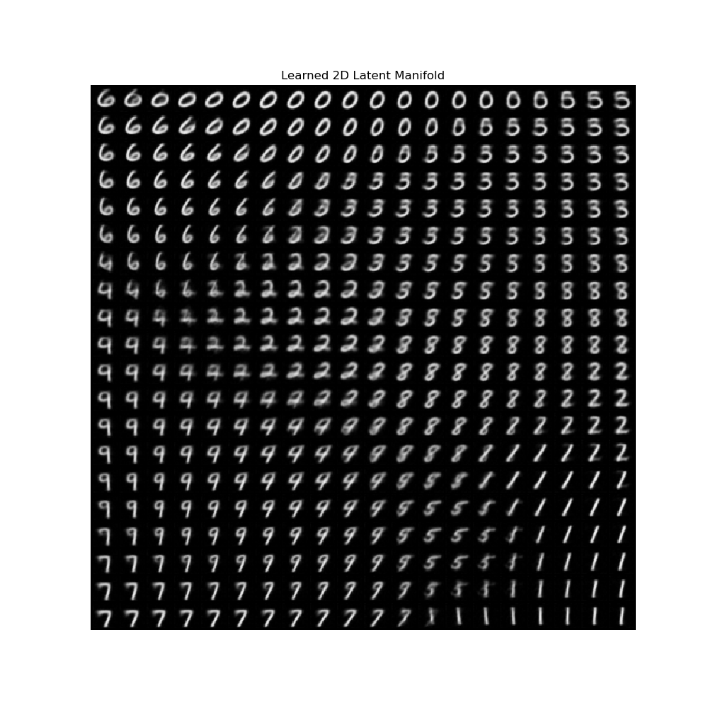

<h1 align="center">
  <b>MNIST VAE Implementation</b><br>
</h1>
<p align="center">
      <a href="https://www.python.org/">
        </a>
       <a href= "https://pytorch.org/">
        </a>
</p>

## Overview

This repository contains a PyTorch implementation of a Variational Autoencoder (VAE) for the MNIST dataset. The VAE is a generative model that learns to encode and decode images, allowing for the generation of new images similar to the training data.


```bash
$ git clone https://github.com/danielwang7/MNIST-VAE.git
$ cd MNIST-VAE
$ pip install -r requirements.txt
```
## Components

`model.py` → implementation of the model and ELBO loss; obtained from the [PyTorch VAE](https://github.com/AntixK/PyTorch-VAE?tab=readme-ov-file) repository 
`train.py` → Contains logic for training the VAE
`visualize.py`→ Contains logic for generating visualizations of latent space and samples

## Results
Example of a 20x20 visualization of the learned MNIST manifold:

<div align="center">
    
</div>


## Theory & Mathematics

The theory and mathematics behind VAEs are detailed in the paper by D.P. Kingma and M. Welling, linked in the acknowledgements. 

This section I give a brief summary of the goal of the model hopefully to aid your understanding.

***The central problem is as follows:***

1) We have a large dataset of identically distributed independent samples of a stochastic variable $X$
2) We want to generate new samples from $X$, which is to find marginal likelihood $p(x)$

*However, this is difficult since:*

- A specific sample of $X$ is generated from the conditional distribution $p_\theta(x|z)$, where $z$  is a latent variable coming from a prior distribution with parameters $\theta$
	- In other words, we assume there is some latent variable $z$ that explains the variation in $x$

- Finding $p(x)$ is intractable. For instance, we are not able to compute the integral 

$$p(\bar{x}) = \int_z p(\bar{x}, z) \, dz = \int_z p(\bar{x} \mid z) p(z) \, dz$$

***We define the following terms for our solution to this problem:***

1) **Prior:** $p(z) = \mathcal{N}(0, I)$, note that it’s gaussian by assumption

2) **True Posterior:** ${p_\theta(z \mid x)}$
	1) This is the actual distribution over latent codes given data
	2) Again, this distribution is intractable, which is the key motivation for VAEs

*Encoder and Decoder:*

3) **Approximate Posterior:** ${q_\phi(z \mid x)} \approx p_\theta(z\mid x)$
	1) *This is the encoder’s output:* a learned approximation of the true posterior, we learn this using a neural network, with ELBO as the loss

4) **Likelihood** $p_\theta(x \mid z)$
	1) *This is the decoder*: it generates/reconstructs $x$ given a latent variable $z$, we also learn this using a neural network
		1) we can then reconstruct a new data point by computing the Bayes Rule:

$$
p_{\theta}(x)=\frac{p_\theta(x\mid z)p_\theta(z)}{p_\theta(z \mid x)}
$$

Without going into the derivation, the ELBO is as follows, and is used as the loss for the encoder and decoder:

$${
\log p_\theta(x) \geq \mathbb{E}_{z \sim q\phi(z \mid x)}[\log p_\theta(x \mid z)] - \text{KL}(q_\phi(z \mid x) \,\|\, p(z))
}$$


- One last detail referred to as the **reparameterization trick;** we need to find a way to sample the distribution that is differentiable to be able to optimize it with stochastic gradient descent

- To do this, we separate stochastic part of $z$, transform it with input and parameters of encoder with transformation function $g$

$$
z=g_\phi(\epsilon, x)
$$
1. $\epsilon \sim p(\epsilon)$ → generate from distribution independent from encoder params, like a simple gaussian
2. $z=\mu + \sigma \epsilon$ , where $\epsilon \sim \mathcal{N}(0,1)$ → transform the sample with a function to desired distribution


This has been a super brief overview of VAE math, and is exactly what this code implements.


## Acknowledgments

  
The model is from the PyTorch VAE repository that can be found [here](https://github.com/AntixK/PyTorch-VAE)


The dataset is from the MNIST dataset that can be found [here](http://yann.lecun.com/exdb/mnist/)

  
The theory behind the VAE is from the original paper [Auto-Encoding Variational Bayes](https://arxiv.org/abs/1312.6114) by D. P. Kingma and M. Welling.